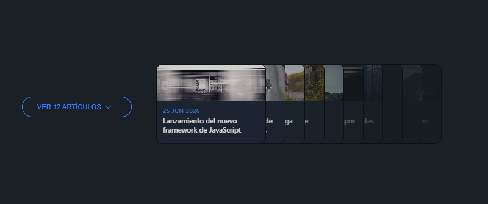
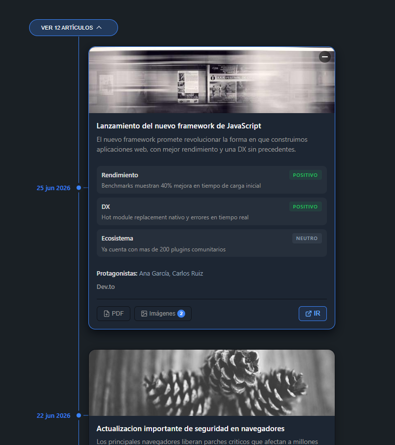

# TimelineViewer

Interactive timeline component that displays news articles as an overlapping card stack with an expandable full timeline view.

## Getting Started

```bash
npm start
```

Opens `http://localhost:3010` — no build step required, just Node.js.

## Options

The `Timeline` constructor accepts a single config object:

| Option          | Type                           | Default    | Description                          |
|-----------------|--------------------------------|------------|--------------------------------------|
| `container`     | `string` (CSS selector/Element)| **required** | DOM element to mount into          |
| `items`         | `Array`                        | `[]`       | Array of article card objects        |
| `featuredCount` | `number`                       | `6`        | Cards in the featured stack          |
| `lastUpdated`   | `string` (ISO date)            | `''`       | Timestamp shown in the footer        |

### Item fields

Each object in `items` supports these fields:

| Field          | Type                        | Description                              |
|----------------|-----------------------------|------------------------------------------|
| `id`           | `number` / `string`         | Unique identifier                        |
| `title`        | `string`                    | Article headline                         |
| `description`  | `string`                    | Short summary                            |
| `date`         | `string` (YYYY-MM-DD)       | Publication date                         |
| `crawlDate`    | `string` (ISO)              | When it was crawled                      |
| `tone`         | `"positivo"` / `"negativo"` / `"neutro"` | Overall sentiment       |
| `fuente`       | `string`                    | Source / publication name                |
| `image`        | `string` (URL) / `null`     | Main card image                          |
| `link`         | `string` (URL)              | External article link                    |
| `protagonista` | `string[]`                  | Key people or entities                   |
| `hasPdf`       | `boolean`                   | PDF download available                   |
| `images`       | `string[]`                  | Additional image gallery URLs            |
| `temas`        | `{ title, desc, tone }[]`   | Topics / themes within the article       |

## Preview




---

*Vibecoded with [opencode](https://opencode.ai) and free AI models.*
