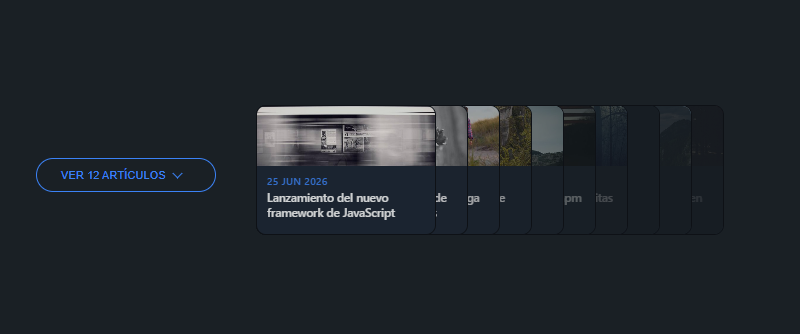
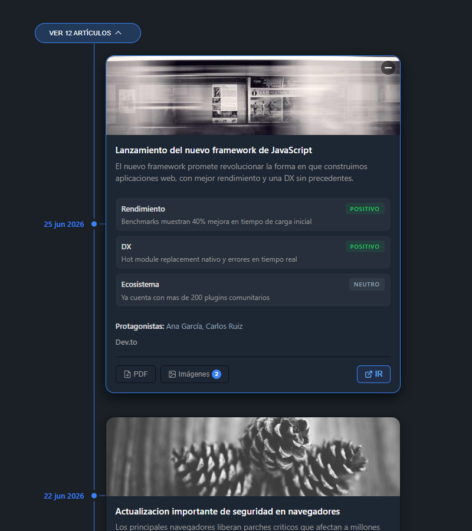

# TimelineViewer

Interactive timeline component that displays news articles as an overlapping card stack with an expandable full timeline view.

## Installation

```bash
npm install https://github.com/GastonZalba/timeline-viewer
```

## Usage

```js
import Timeline from 'timeline-viewer';

new Timeline({
  container: '#my-container',
  items: [
    {
      id: 'FUE-00001',
      nombre_fuente: 'Lanzamiento del nuevo framework de JavaScript',
      resumen_ia: 'El nuevo framework promete revolucionar la forma en que construimos aplicaciones web.',
      thumbnail: 'https://picsum.photos/seed/noticia1/600/400',
      link_web: 'https://dev.to/news/javascript-framework-2026',
      fecha_publicacion: '2026-06-25',
      fecha_scrapeo: '2026-06-25T14:30:00',
      tonos_sociales: ['Positivo'],
      fuente_institucional: 'Dev.to',
      tipo_fuente: 'Digital',
      es_oficial: true,
      adjuntos: [],
      actores_principales: ['Ana García', 'Carlos Ruiz'],
      screenshot: 'https://picsum.photos/seed/captura/400/800',
      imagenes: [
        { 
          thumb: 'https://picsum.photos/seed/img1/300/200', 
          full: 'https://picsum.photos/seed/img1/600/400'
        }
      ],
      temas: []
    }
  ],
  featuredCount: 6,
  itemsPerPage: 10,
  lastUpdated: '2026-06-25T14:30:00'
});
```

## Options

The `Timeline` constructor accepts a single config object:

| Option          | Type                           | Default    | Description                          |
|-----------------|--------------------------------|------------|--------------------------------------|
| `container`     | `string` (CSS selector/Element)| **required** | DOM element to mount into          |
| `items`         | `Array`                        | `[]`       | Array of article card objects        |
| `featuredCount` | `number`                       | `6`        | Cards in the featured stack          |
| `itemsPerPage`  | `number`                       | `10`       | Items per page in timeline. `0` shows all items without pagination |
| `lastUpdated`   | `string` (ISO date)            | `''`       | Timestamp shown in the footer        |

### Item fields

Each object in `items` supports these fields:

| Field                  | Type                        | Description                              |
|------------------------|-----------------------------|------------------------------------------|
| `id`                   | `string`                    | Unique identifier (e.g. `FUE-00001`)    |
| `nombre_fuente`        | `string`                    | Article headline                         |
| `resumen_ia`           | `string`                    | AI-generated short summary               |
| `thumbnail`         | `string` (URL) / `null`     | Main card image                          |
| `link_web`             | `string` (URL)              | External article link                    |
| `fecha_publicacion`    | `string` (YYYY-MM-DD)       | Publication date                         |
| `fecha_scrapeo`        | `string` (ISO)              | When it was crawled                      |
| `tonos_sociales`      | `string[]`                  | Overall sentiment(s) — unique tones present in the article's `temas` |
| `fuente_institucional` | `string`                    | Source / publication name                |
| `tipo_fuente`           | `string`                    | Source type. One of: `Diario o nota periodística`, `Decreto o norma`, `Boletín oficial`, `Expediente`, `Libro o publicación`, `Sitio web o portal`, `Red social`, `Gacetilla o comunicado de prensa` |
| `es_oficial`            | `boolean`                   | Whether the source is official (`true`) or not (`false`) |
| `adjuntos`              | `string[]`                  | Attached files/links — may be empty |
| `actores_principales`  | `string[]`                  | Key people or entities                   |
| `screenshot`           | `string` (URL) / `null`     | Screenshot image URL                     |
| `imagenes`             | `{ thumb: string; full: string }[]` | Image gallery with low-res `thumb` and full-res `full` URLs |
| `temas`                | `{ titulo, resumen, tono_social, fecha_narrativa? }[]` | Topics / themes within the article. `fecha_narrativa` is an optional `string` (`YYYY-MM-DD`) or `null` |

### Embedded content

When the card is expanded, `link_web` is automatically parsed for supported platforms and embedded just above the card actions:

| Platform  | URL pattern                    | Method                                                  |
|-----------|--------------------------------|---------------------------------------------------------|
| YouTube   | `/watch?v=`, `youtu.be/`, `/shorts/` | Direct `<iframe>` with 16:9 aspect ratio          |
| Instagram | `/p/`, `/reel/`                | Official [embed.js](https://www.instagram.com/embed.js) via `<blockquote class="instagram-media">` |
| Twitter/X | `/username/status/ID`          | Official [Twitter Widgets](https://platform.twitter.com/widgets.js) via `<blockquote class="twitter-tweet">` |
| Facebook  | `/posts/`, `/videos/`, `/permalink.php`, `/photo.php`, `/watch`, `fb.watch` | Official [Facebook SDK](https://connect.facebook.net/es_ES/sdk.js) via `<div class="fb-post">` |

Instagram, Twitter/X, and Facebook use **their official embed SDKs** instead of raw iframes. The scripts are loaded **lazily**.

Profile pages, channels, playlists and other non-content URLs are ignored.

## Build

```bash
npm run build
```

Compiles TypeScript (`src/TimelineViewer.ts`) and SCSS (`src/styles.scss`) into `dist/`. The resulting JS, type declarations, and CSS are ready for distribution.

> **Nota:** Los archivos de `dist/` se generan automáticamente con el build. No los edites a mano — haz los cambios en `src/` y ejecuta `npm run build`.

Run only the TypeScript compilation:
```bash
npm run build:ts
```

## Development

```bash
npm run dev
```

Starts the dev server at `http://localhost:3010` with a demo page, and automatically recompiles TypeScript and SCSS on every change. No need to manually build.

To run the server without the file watchers:

```bash
npm start
```

The demo page loads lightgallery JS and CSS from CDN via importmap. Consumers are responsible for providing lightgallery as a peer dependency.

## Preview




---

*Vibecoded with [opencode](https://opencode.ai) and free AI models.*
