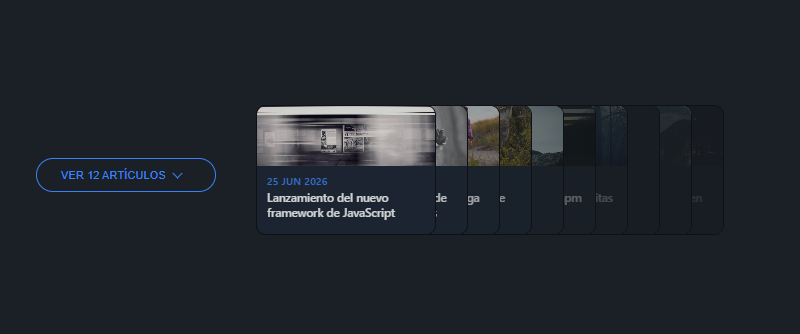
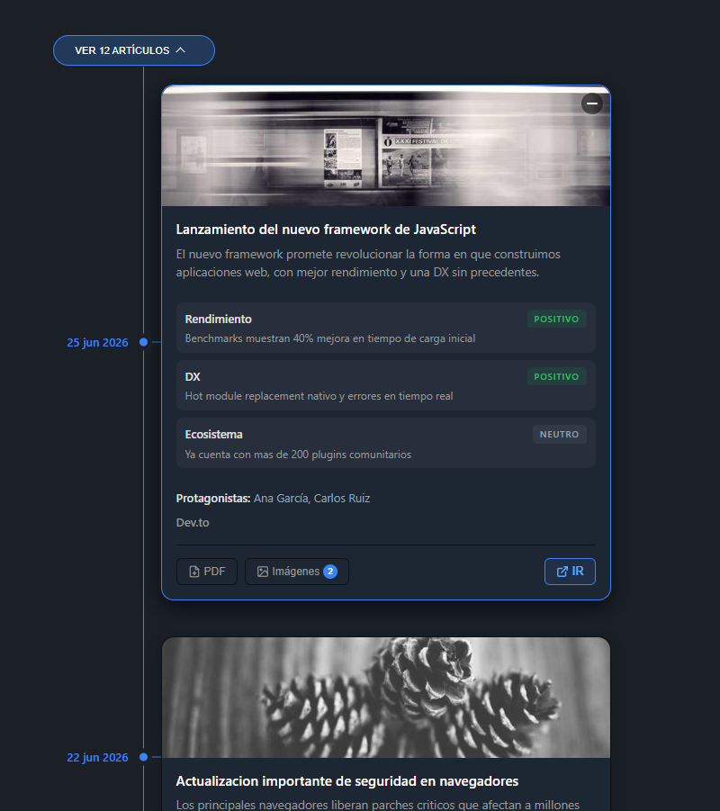

# TimelineViewer

Interactive timeline component that displays news articles as an overlapping card stack with an expandable full timeline view.

## Installation

```bash
npm install https://github.com/GastonZalba/timeline-viewer
```

The component is vanilla DOM and ships as a single ES module + CSS with no bundler. It has two **peer dependencies** the consumer must provide: `lightgallery` (`^2.9.0`, for the image galleries) and `ol` (`^10.10.0`, for the [topics map](#topics-map)). Both are loaded lazily, when the feature that needs them is first used.

## Usage

```js
import Timeline from 'timeline-viewer';

new Timeline({
  container: '#my-container',
  content: [
    {
      label: 'Tecnología y herramientas',
      items: [
        {
          id: 'FUE-00001',
          nombre_fuente: 'Lanzamiento del nuevo framework de JavaScript',
          resumen_ia: 'El nuevo framework promete revolucionar la forma en que construimos aplicaciones web.',
          thumbnail: 'https://picsum.photos/seed/noticia1/600/400',
          link_web: 'https://dev.to/news/javascript-framework-2026',
          fecha_publicacion: '2026-06-25',
          fecha_scrapeo: '2026-06-25T14:30:00',
          tonos_sociales: ['Positivo'],
          fuente_institucional: 'Dev.to',
          tipo_fuente: 'Sitio web o portal',
          es_oficial: true,
          validado: true,
          adjuntos: [],
          actores_principales: ['Ana García', 'Carlos Ruiz'],
          screenshot: 'https://picsum.photos/seed/captura/400/800',
          imagenes: [
            {
              thumb: 'https://picsum.photos/seed/img1/300/200',
              full: 'https://picsum.photos/seed/img1/600/400'
            }
          ],
          links_videos: ['https://www.youtube.com/watch?v=dQw4w9WgXcQ'],
          temas: []
        }
      ]
    }
  ],
  featuredCount: 6,
  itemsPerPage: 10,
  inlineImages: true,
  inlineAdjuntos: true,
  lastUpdated: '2026-06-25T14:30:00'
});
```

## Options

The `Timeline` constructor accepts a single config object:

| Option          | Type                           | Default    | Description                          |
|-----------------|--------------------------------|------------|--------------------------------------|
| `container` | `string` (CSS selector/Element) | **required** | DOM element to mount into |
| `content`       | `ContentGroup[]`              | `[]`       | Optional. Array of `{ label, items }` groups: the **medium taxonomies**. The `label` of each group becomes an option of the selector shown above the expanded timeline, shown next to the number of articles of that group, and the timeline and the filters are scoped to the selected group (with 2+ groups a trailing **"Ver todo"** option scopes the timeline back to the whole pool). The counter in the expand button always shows the **total of every group**, regardless of the selected taxonomy. Takes precedence over `items`. Groups with no `label` or with an empty `items` array are ignored. When no group survives (or in API mode) **no selector is rendered and the layout is unchanged**. See [Content taxonomies](#content-taxonomies) |
| `items`         | `TimelineItem[]`              | `[]`       | Legacy flat list of article card objects. Ignored when `content` is set. Kept for backwards compatibility: with no `content` the component behaves exactly as before |
| `api`           | `{ url: string; fetchImpl?: typeof fetch }` | — | Optional. Enables **API mode**: the component fetches the paginated list from `{url}`, the static collection values (filter counts, total, `lastUpdated`) from `{url}/facets` (**once, at startup**) and the lazy detail of each card from `{url}/:id`. When set, `content` and `items` are ignored, **no taxonomy selector is rendered**, and filters, search, sort and pagination are resolved server-side. `fetchImpl` allows injecting a custom fetch (useful for tests or auth headers) |
| `featuredCount` | `number`                       | `6`        | Cards in the featured stack          |
| `startExpanded` | `boolean`                      | `false`    | When `true`, the timeline starts **already expanded** instead of collapsed on the featured stack. It only sets the initial state: the expand toggle keeps working and the choice is **not persisted**, so every page load starts from this value. Ignored in single mode (`singleId`), which always renders a single expanded card. |
| `fullpage`    | `boolean`                      | `false`    | When `true`, renders in **fullpage mode**: the timeline is always open and the **page itself is what scrolls**. It implies `startExpanded`, makes the timeline non-collapsible (the expand button keeps showing the related count but loses its chevron and its click), removes the height limit of the list (so `#timeline-cards` is never a scroll box on its own), removes the **resize handle**, and **pins the toolbar** (counter, search, filters, sort and internal buttons) to the top of the viewport. The featured stack is not rendered at all, since it would never be seen, so `featuredCount` has no effect. Ignored in single mode (`singleId`), which already renders a single expanded card. See [Fullpage mode](#fullpage-mode) |
| `filters` | `TimelineFilter[]` | — | Optional. Declares the **filter groups** of the toolbar: each one has a `field`, a `label`, a `group` (`'menu'` panel column or `'filtros_internos'` internal-filters flyout) and its `items` (the values it offers, with their label and whether they start checked). Both the toolbar and the query parameters of API mode come from here, so without the option there is **no filter UI at all** (no button, no panel, no params). A group without `items` derives its values from the data. Groups with a missing `field`/`label`, an unsupported `type`, a duplicated `field` or an unusable `items` are dropped with a `console.warn`. See [Configurable filters](#configurable-filters) |
| `sorters` | `TimelineSorter[]` | — | Optional. Declares the **sort options** of the toolbar: each one has a `field` (the `TimelineItem` field to order by) and a `label`, and one can be marked `default: true` to start selected. The button opens a menu with a radio per option plus a global direction pair ("Más reciente primero" / "más antiguo primero"), and the active field travels as the `sortBy` param in API mode. Without the option there is **no sort UI at all** (no button, no menu) and the timeline keeps its built-in `fecha_publicacion` descending order. Entries with a missing `field`/`label` or a duplicated `field` are dropped with a `console.warn`. See [Configurable sort](#configurable-sort) |
| `itemsPerPage`  | `number`                       | `10`       | Items per page in timeline. `0` shows all items without pagination. Below the list a status row shows the range of positions on screen — "Mostrando 11-20 de 55 publicaciones" — which is the current page with `pagination: true` and everything loaded so far with "Cargar más" (so it starts at 1 and grows). In local mode the range is sliced out of the filtered pool; in API mode the total is the one the server sends. Ignored in single mode (`singleId`) |
| `pagination`    | `boolean`                      | `false`    | When `true`, the **"Cargar más" button is replaced by a paginator** — "‹ Anterior &#124; Página X de Y &#124; Siguiente ›" — that jumps between fixed-size pages instead of appending them, in local mode and in API mode alike. `itemsPerPage` is the size of every page, so the current page always shows exactly that many articles (less on the last one), which is what the API mode already sends per request. `0` still means "no pagination" (no paginator, no button). Because the pages are disjoint, a page change **replaces** the list rather than adding to it, and the timeline scrolls back to the top; in API mode the outgoing cards are swapped for the loading placeholders right away, since they are no longer what was asked for. The featured stack stays on the first page's, so collapsing the timeline always brings back the same articles. Works together with the search, the filters, the sort and the taxonomy selector: any of them starts over at page 1. Ignored in single mode (`singleId`) |
| `lastUpdated`   | `string` (ISO date)            | `''`       | Timestamp shown in the footer        |
| `inlineImages`  | `boolean`                      | `false`    | When `true`, shows the `imagenes` thumbnails inline inside each expanded card (below the summary, before the topics) and hides the "Imágenes" action button (the inline thumbs replace it). Clicking a thumbnail opens the gallery at that image |
| `inlineAdjuntos` | `boolean` | `false` | When `true`, shows the `adjuntos` inline inside each expanded card (below the topics) as a list of file names with a type icon (PDF vs generic, inferred from the extension), and hides the "Adjuntos" action button. Both this block and the hidden "Adjuntos" menu link each file with `download`, so same-origin attachments are saved instead of opened in a tab |
| `internalButtons` | `boolean` | `false` | When `true`, shows the internal work controls in the timeline toolbar: the red "work notes" toggle (hide/show `notas_de_trabajo` on cards and topics, and the topic's `id_subtema` in red at the end of its title) and the red "Filtros internos" flyout button. The flyout only renders when the `filters` option declares at least one group with `group: 'filtros_internos'` (validado / capturado / descartado in the demo). When `false` (default) those buttons are not rendered |
| `stateInUrl`    | `boolean`                      | `false`    | When `true`, the **address bar becomes a shareable link of the view**: whoever opens it sees the same search, filters, order, taxonomy and page. The state travels as query params under the `tv_` prefix (`tv_q`, `tv_<field>` with the active values as CSV, `tv_sortBy` + `tv_sort`, `tv_tax`, `tv_page`), which are the very same params API mode sends to the server. The URL is read **once**, before the first render (so a link opens on the view it shares, and the first API request already carries the filters) and written with `history.replaceState` after every change: it is a snapshot of the view, not a navigation log, so there is no back button and nothing is pushed to the history. Mounting never rewrites the URL it just read; the first interaction does, and that is also when the `tv_*` keys that are not in effect get dropped — **what the link asks for that this instance cannot do is ignored silently** (a filter the consumer did not declare, a value that no longer exists, an order or a taxonomy that is not there, a page out of range): nothing warns, nothing breaks, and a group whose values leave nothing checked simply does not filter. Params outside the `tv_` prefix are never touched, so the consumer keeps its own flags. Ignored in single mode (`singleId`). See [State in the URL](#state-in-the-url) |
| `relatedLabel`   | `(count: number) => string`    | —          | Optional. Function that returns the expand button label ("publicaciones relacionadas") for the given count. When unset, the default Spanish label is used with singular/plural logic. `count` is the **total number of publications, independent of the selected taxonomy** (the same number shown next to the label), which keeps the singular/plural grammatical. The returned string is injected as **HTML (not escaped)**, so it can contain markup (e.g. `'artículos relacionados sobre <b>Plan Integral</b>'`); escape any untrusted value before returning it |
| `singleId`       | `string`                       | —          | Optional. When set (e.g. `'/FUE-0001'` or `'FUE-0001'`), renders a **single already-expanded card** with its full detail and no timeline chrome (no featured stack, filters, search, sort, pagination or status bar). The card cannot be collapsed. With `internalButtons: true`, a toolbar with the red work-notes toggle is shown above the card. Works in both local (`items`) and API mode. The navigation links block under the card is not configured here: it comes from the item's own `taxonomias` field. See [Single view taxonomies](#single-view-taxonomies) |
| `temasMapTiles`  | `string`                       | `https://tile.openstreetmap.org/{z}/{x}/{y}.png` | Optional. Tile template for the [topics map](#topics-map) (any `{z}/{x}/{y}` XYZ provider). Passing `''` explicitly opts out of the base layer, leaving the map with only the article's own points |
| `temasMapAttribution` | `string` | `© OpenStreetMap` (a link to its copyright page) | Optional. Credit of the base layer, shown at the bottom of the [topics map](#topics-map). It is the credit of *those* tiles, so **override it when you override `temasMapTiles`**: with your own XYZ provider, `''` takes the attribution out of the map entirely (no empty box left behind). Injected as **HTML (not escaped)**, so the credit can be a link. Ignored when `temasMapTiles` is `''`: with no base layer there are no tiles to attribute |
| `showFullMap` | `boolean` | `false` | When `true`, adds a toolbar button that swaps the whole timeline for a **general map**: one marker per located topic of everything that matches the current search and filters, over the same toolbar. The button only exists with the timeline expanded, like the rest of the toolbar controls, and the toolbar stays on top of the map so the search box and the filter panel keep scoping it. The sort control and the work-notes toggle are hidden while the map is up (there is no list to order, and a map *is* hidden work notes). A filter change re-plots the markers **in place**: the base layer and the view (pan and zoom) are kept, so the map does not flash and the framing you set stays. In API mode the markers of the filter that just ended go away immediately —same criterion as the list, where the cards are replaced by skeletons— and the map is veiled by a full-canvas status overlay ("Cargando elementos del mapa…") until `GET {url}/points` answers; an open marker panel closes with its marker. Clicking a marker opens that article's card in a panel at the bottom left, **expanded** and scrolled to the clicked topic, which is highlighted; the clicked marker stays marked until the panel closes. Clicking the empty map closes it. Ignored in single mode (`singleId`). See [General map](#general-map) |

### Item fields

Each object in `content[].items` (or in the legacy `items`) supports these fields:

| Field                  | Type                        | Description                              |
|------------------------|-----------------------------|------------------------------------------|
| `id`                   | `string`                    | Unique identifier (e.g. `FUE-00001`)    |
| `nombre_fuente`        | `string`                    | Article headline                         |
| `resumen_ia`           | `string` / `null`          | AI-generated short summary. Hidden (not rendered) when `null` |
| `thumbnail`         | `string` (URL) / `null`     | Main card image                          |
| `link_web`             | `string` (URL)              | External article link                    |
| `fecha_publicacion`    | `string` (YYYY-MM-DD)       | Publication date                         |
| `anio_publicacion` | `string` / `null` | Year of `fecha_publicacion` already reduced to text, or `null` when the item has no date. Precomputed by the pipeline so a year filter needs no `extract` |
| `fecha_scrapeo`        | `string` (ISO)              | When it was crawled                      |
| `tonos_sociales`      | `string[]`                  | Overall sentiment(s) — unique tones present in the article's `temas` |
| `fuente_institucional` | `string` / `null`          | Source / publication name                |
| `tipo_fuente` | `string` / `null` | Source type. One of: `Decreto o norma`, `Libro o publicación`, `Sitio web o portal`, `Red Social`, `Gacetilla o comunicado de prensa`, `Video`, or `null` when the detection has no type yet |
| `es_oficial`            | `boolean`                   | Whether the source is official (`true`) or not (`false`) |
| `validado`              | `boolean` / `null`          | Whether the article has been validated (`true`), not validated (`false`), or pending/unknown (`null`) |
| `capturado`             | `boolean`                   | Whether the article has been captured by the pipeline. When `false`, the entry is an unprocessed detection and only `id` and `link_web` are populated; all other fields are empty |
| `descartado`            | `boolean` / `null`          | Whether the article has been discarded (`true`), kept (`false`), or unknown (`null`). By default the filter excludes discarded articles |
| `adjuntos`              | `string[]`                  | Attached files/links — may be empty. Links carry `download`, which browsers only honor for **same-origin** URLs: with the files on another domain the attribute is ignored and the file opens in a new tab (the `target="_blank"` fallback), and only `Content-Disposition: attachment` from the file server forces the download |
| `contenido` | `string[]` | Content types the item carries, preclassified for filtering: `adjuntos`, `video`, `imagenes` (any combination, possibly empty) |
| `actores_principales`  | `string[]` / `null`        | Key people or entities                   |
| `screenshot`           | `string` (URL) / `null`     | Screenshot image URL                     |
| `imagenes`             | `{ thumb: string; full: string }[]` / `null` | Image gallery with low-res `thumb` and full-res `full` URLs. `null` is accepted and treated as an empty gallery |
| `links_videos`         | `string[]` (URL) / `null`  | Optional. Related video links rendered as embeds in the "Videos vinculados" section when the card is expanded. Supported platforms (YouTube, Instagram, Twitter/X, Facebook) are embedded through their SDK/iframe, and so are direct video files (`.mp4`, `.webm`, `.mov`, `.m4v`, `.ogv`), which are played with a native `<video>`. Anything else is ignored |
| `has_video`            | `boolean`                   | Indicates whether the item has audiovisual content: `true` when `links_videos` is non-empty or when `link_web` points to a video (e.g. YouTube, Instagram reel, a direct `.mp4` file) |
| `notas_de_trabajo`     | `string` / `null`           | Optional. Working notes displayed as a red badge above the summary in both collapsed and expanded card states |
| `link_edit_entry`     | `string` (URL) / `null`     | Optional. URL to an edit form. When present, a red "Editar" button is shown next to the "Visitar" button in the card actions |
| `link_view_entry`     | `string` (URL)               | Optional. URL of the item's own **individual view** (the one `singleId` renders). Two things are built from it: the "Información" menu shows the `ID` value as a link with the external-link icon (opened in a new tab, `target="_blank"`), and a floating share button appears below the card's info button. Relative URLs are resolved against the current page (e.g. `'?id=FUE-00001'` or `'/articulos/FUE-00001'`). When the field is absent, the `ID` is plain text and no share button is rendered. The share button uses the [Web Share API](https://developer.mozilla.org/docs/Web/API/Navigator/share) (`{ title, url }`) when available — mobile and Safari; where it is not available (e.g. desktop Chrome) it copies the absolute URL to the clipboard, the icon turns into a checkmark and a small "Copiado al portapapeles!" toast appears under the card buttons for 1.5s |
| `temas`                | `{ id_subtema, titulo, resumen, tono_social, fecha_narrativa?, notas_de_trabajo?, geom? }[]` | Topics / themes within the article. `id_subtema` is the topic's own **primary key**, unique across the whole collection (e.g. `T-000001`): it is what the [general map](#general-map) uses to open the panel scrolled to and highlighting the topic whose marker was clicked, and it travels in `GET {url}/points` as `id_subtema`. While the `internalButtons` option is on and work notes are visible, it is also rendered in red at the end of the topic title, hidden by the same toggle as `notas_de_trabajo`. `fecha_narrativa` is an optional `string` (`YYYY-MM-DD`) or `null`. `notas_de_trabajo` is an optional working note displayed as a red badge below the theme description. `geom` is an optional `{ lat: number, lon: number }` that places the topic on the [topics map](#topics-map); missing or out-of-range coordinates simply leave the topic off the map while keeping it in the list |
| `taxonomias`           | `{ label: string, items: { content: string, link: string }[] }[]` | Optional. Groups of navigation links rendered as a block **under the card in single mode** (`singleId`), each group in its own column. See [Single view taxonomies](#single-view-taxonomies) |

> **Importante:** `example/mock-data.js` es la fuente de verdad para probar el componente. Cualquier campo que se agregue, renombre o elimine en el mock **debe** actualizarse en el mismo cambio en la interfaz `TimelineItem` (`src/TimelineViewer.ts`), en la declaración de tipos generada (`dist/TimelineViewer.d.ts` vía `npm run build`) y en esta tabla de campos. Los valores de `tipo_fuente` y los `tonos_sociales` se documentan según los que existen en el mock.

### Modo API (servidor)

Para volúmenes grandes se puede delegar el filtrado, la búsqueda, el orden y la paginación al servidor. En vez de `content` (o `items`), se pasa una configuración `api`:

```js
new Timeline({
  container: '#my-container',
  api: { url: '/api' },
  itemsPerPage: 10,
  featuredCount: 6
});
```

En este modo la lista viaja solo lo que la tarjeta colapsada muestra de inmediato (título, resumen, thumbnail, badges, tonos, fecha y `link_view_entry` para el botón de compartir). El resto — barra de acciones (captura, imágenes, adjuntos, abrir, editar), embed de la publicación original, menú de información, actores, fuente, temas, media, videos y los grupos de `taxonomias` del modo single — se obtiene con `GET {url}/:id`, que devuelve el contrato completo de `TimelineItem`.

Al iniciar se hacen **dos** requests, en paralelo: `GET {url}` (la primera página, que basta para el stack colapsado de destacadas) y `GET {url}/facets`, que trae los **valores estáticos de la colección** —los conteos de los filtros, el total y el `lastUpdated`— y por eso se piden una única vez: de ahí en adelante cada cambio de búsqueda, filtro u orden vuelve a pegarle solo a la lista, sin volver a pedir los facets y conservando el estado de los checkboxes.

Mientras una respuesta de lista está en vuelo, el componente muestra **tarjetas fantasma con shimmer** en vez de los resultados anteriores: los que están en pantalla ya no corresponden a lo pedido, así que se van en el acto y se reponen cuando llegan los datos, con la lista nuevamente arriba. Es lo que corresponde a todo request que **reemplaza** la lista: el inicial, los de búsqueda / filtros / orden y también el cambio de página del paginador numérico (`pagination: true`), que muestra los skeletons en el acto en vez de dejar la página que se está dejando en pantalla. Las acciones discretas (un checkbox, el botón de orden, `Esc` en el buscador) disparan su request **sin espera**; el texto del buscador espera 300 ms a que se termine de escribir, para no pedirle al servidor un request por tecla. Cuando llegan los datos, las tarjetas **toman el lugar de los placeholders sin volver a entrar con la animación de slide**: el shimmer ya ocupaba esa posición, así que la lista se reemplaza en el sitio. "Cargar más" no hace nada de esto: deja las tarjetas que ya estás leyendo y solo agrega la línea "Cargando más publicaciones..." al pie. Con el paginador, esa fila de status no muestra la carga (la cubren los skeletons) pero sí el **conteo**: "Página X de Y" dice cuál es la página y cuántas hay, y "Mostrando 11-20 de 55 publicaciones" qué tranche del resultado filtrado está en pantalla. Si un request falla, la lista queda vacía con el mensaje de error — también al cambiar de página, sin volver a la página anterior: hay que reintentar la acción o recargar.

#### Endpoints

| Endpoint          | Uso                                                                    | Respuesta                    |
|-------------------|------------------------------------------------------------------------|------------------------------|
| `GET {url}`       | Lista paginada con búsqueda, filtros y orden                        | Objeto con `items` y `total` |
| `GET {url}/facets` | Valores estáticos de la colección completa: conteos de los filtros, total y `lastUpdated`. Se pide **una sola vez**, al iniciar, en paralelo con la primera página | Objeto con `facets`, `total` y `lastUpdated` opcional |
| `GET {url}/points` | Un punto por tema ubicado de lo que matchea la búsqueda y los filtros, sin paginar. Solo se pide si `showFullMap` está activo y el mapa general se abrió | Objeto con `points` (y `total`) |
| `GET {url}/:id`   | Detalle completo de un artículo (cargado lazy al expandir la tarjeta, y en single mode) | El `TimelineItem` completo, **sin envolver** (no lleva `{"item": ...}`) |

> El campo `items` de la respuesta es la lista paginada que devuelve el servidor y **no** tiene relación con la opción `content` ni con el alias legacy `items`. En modo API no se renderiza el selector de taxonomías.

> `GET {url}/facets` y `GET {url}/points` tienen prioridad sobre `GET {url}/:id`: una ruta `/facets` o `/points` no puede ser un id de artículo.

> Los puntos de `GET {url}/points` son planos y llevan `id` (el del **artículo**), `id_subtema` (opcional), `titulo`, `nombre_fuente`, `tono_social` y `geom`. El `id_subtema` es la primary key del subtema dentro del artículo (en el mock, `T-000001`) y es lo que permite abrir la ficha scrolleada hasta el tema clickeado; sin él el mapa funciona igual, solo sin scroll ni resaltado.

#### Parámetros de `GET {url}`

Los parámetros de filtro son los **grupos declarados** en la opción `filters`, con los valores activos como CSV. Los del modo local y del API son idénticos: el servidor los acepta aunque la colección no tenga valores para un campo. Los del demo (declarado en `example/filters.js`):

| Parámetro          | Tipo      | Descripción                                                              |
|--------------------|-----------|--------------------------------------------------------------------------|
| `page`             | `number`  | Página solicitada, 1-indexed (default `1`). Es el cursor del servidor: el componente nunca pagina del lado del cliente en modo API, así que cada salto de página es un request a este endpoint |
| `pageSize`         | `number`  | Ítems por página (default `10`). Con `itemsPerPage: 0` ("sin paginación") el componente manda un `pageSize` enorme para traer la colección entera en una sola respuesta, así que el server no tiene que reconocer un modo "todo" aparte |
| `sort`             | `asc`/`desc` | Dirección del orden: `desc` (reciente primero) es el default, y cualquier valor distinto de `asc` cae a `desc`. El campo lo elige `sortBy`. Los ítems **sin valor para ese campo van al final en `desc` y al principio en `asc`**, que es lo que hace el componente en modo local |
| `sortBy`           | `string`  | Campo por el que se ordena, tal como lo declara el consumidor en su opción `sorters` (el demo: `fecha_publicacion` o `id`). Default `fecha_publicacion` si no viene. El servidor no lo valida contra una lista: es la contraparte de los campos de `filters`, el cliente decide por qué campos se puede ordenar |
| `q`                | `string`  | Texto libre. Coincide con `id`, `nombre_fuente`, `fuente_institucional` y `actores_principales`, sin distinguir acentos ni mayúsculas |
| `tonos_sociales`   | `string`  | CSV de tonos (`Positivo`, `Negativo`, `Neutro`) — OR dentro del campo    |
| `tipo_fuente` | `string` | CSV de tipos (`Sitio web o portal`, ...) o `null` para los que no declaran tipo |
| `anio_publicacion` | `string` | CSV de años (`2026`, ...) o `null` para el ítem sin fecha |
| `contenido`        | `string`  | CSV de `adjuntos`, `video`, `imagenes`                                   |
| `validado` | `string` | CSV of the checked values of the group: `true`, `false` and/or `null` |
| `capturado` | `string` | CSV of `true`, `false` and/or `null` |
| `descartado` | `string` | CSV of `true`, `false` and/or `null` |
| `es_oficial` | `string` | `true` / `false` |

> **Los valores viajan tal como los declara el consumidor.** El `value` de cada ítem es el token que se manda: `true` viaja como `true`, `false` como `false` y `null` como `null` (el string de cuatro letras, no ausencia). Cuando un ítem declara varios valores, viajan unidos por comas en el mismo param: `{ value: [false, null] }` se manda como `descartado=false,null`, y el servidor lo parte por comas como cualquier otro CSV. Por eso un `value` no puede contener una coma: `_normalizeFilters()` descarta el grupo entero con un `console.warn`. En el lado del ítem la comparación es por token: un `null` matchea los ítems que no traen el campo (o lo traen en `null`), y un valor que el ítem trae en un array cuenta (`tonos_sociales`, `contenido`).

> **Dónde caen los ítems sin valor.** El bucket de los que no traen el campo activo (`fecha_publicacion` por defecto, o el que declare `sortBy`) **es parte de la dirección**, no un grupo fijo: en `desc` quedan al final y en `asc` quedan al principio. El modo local hace lo mismo —la comparación natural trata el valor ausente como el más chico, y la dirección se aplica a toda la lista (`_sortBy()` en `_applyFilters()`)—, así que un backend que lo haga de otra forma muestra los sin valor en un lado en un modo y en el otro en el otro, y el componente no tiene forma de corregirlo: en modo API nunca ordena del lado del cliente, renderiza la página tal cual la devuelve el servidor.

#### Respuesta de `GET {url}`

```jsonc
{
  "items": [/* TimelineItemSummary[] */],
  "total": 123               // total de publicaciones que matchean búsqueda + filtros
}
```

> Hay **dos** totales y no son lo mismo: el `total` de la lista es lo que matchea búsqueda + filtros, y alimenta la paginación —el status "Mostrando A-B de Y publicaciones" (un rango de posiciones: con `pagination: true` es el de la página en pantalla, y con "Cargar más" arranca siempre en 1 y crece con la lista) y la aparición del botón "Cargar más" (`Y` = `total`), además del "Página X de Y" del paginador cuando `pagination: true`—; el `total` de `GET {url}/facets` es el de la colección completa, sin `q` ni filtros, y alimenta el número y el `relatedLabel` del botón de expandir. Igual que en modo local, donde el contador es `_allItems().length` (pool sin filtrar) y la paginación corre sobre los items ya filtrados. Por eso el contador no se mueve al buscar o filtrar.

> Las tarjetas destacadas (el stack colapsado) se arman con los **primeros `items` de la página** —las primeras con `capturado !== false`, hasta `featuredCount`—, así que el servidor no devuelve ningún campo `featured` ni recibe el parámetro `featured`. Con `pagination: true` se capturan en la **primera** página y no cambian al navegar: colapsar el timeline en la página 3 vuelve a mostrar las destacadas de la primera, no las de la que se está viendo.

> `lastUpdated` **no** viaja en la lista: llega con `GET {url}/facets` (o se pasa por la opción `lastUpdated`). Como los facets se piden al iniciar, el pie "Actualizado por última vez el ..." del timeline ya está completo en el primer render, sin volver a renderizar las tarjetas.

#### Respuesta de `GET {url}/facets`

```jsonc
{
  "facets": {
    "tonos_sociales": { "Positivo": 15, "Negativo": 5, "Neutro": 8 },
    "tipo_fuente": { "Sitio web o portal": 9, "null": 2 },
    "anio_publicacion": { "2026": 15, "null": 2 },
    "contenido": { "adjuntos": 4, "video": 6, "imagenes": 8 },
    "validado": { "true": 12, "false": 3, "null": 4 },
    "capturado": { "true": 17, "false": 2 },
    "descartado": { "true": 2, "false": 12, "null": 5 },
    "es_oficial": { "true": 10, "false": 9 }
  },
  // opcional: el texto a mostrar de cada token. Solo se lee; el filtro sigue yendo por la clave.
  "labels": {
    "tipo_fuente": { "Sitio web o portal": "Sitio web", "Gacetilla o comunicado de prensa": "Gacetilla" },
    "tonos_sociales": { "Positivo": "Tono positivo" }
  },
  "total": 19,                              // total de la colección, sin q ni filtros
  "lastUpdated": "2026-06-25T14:30:00"     // opcional
}
```

Los `facets` y el `total` se calculan sobre la **colección completa**, sin depender de `q` ni de los filtros activos, y por eso no cambian: se piden una sola vez, al iniciar, y tanto el panel de filtros como el contador del botón de expandir se reconstruyen con ese único request (los checkboxes se crean de antemano sin conteos, así que los `checked` declarados —o los `filtros_internos` ya persistidos— viajan en la primera request de la lista). Como consecuencia, los números entre paréntesis son el total de la colección y **no** el conteo de la búsqueda actual, y los valores de un filtro no desaparecen al filtrar (un grupo que deriva sus valores se oculta solo si la colección tiene un solo valor para ese campo; uno que declara `items` no se oculta nunca). **Las claves de los facets son los mismos tokens que los `value` declarados**: como la comparación es por token, `"null"` cuenta los ítems sin valor y `"true"` los que traen el booleano, así que el servidor no renombra nada (`example/server.js` ya no tiene lógica por campo: solo tokeniza con `String()`).

#### `labels`: la clave que filtra y el texto que se muestra

`labels` es **opcional** y es lo que separa el valor con el que se filtra del texto que el usuario lee: la clave es el mismo token que ya está en `facets` (y es el que viaja en el query param, tal cual), y el valor es el texto a mostrar. Sirve para que el backend guarde un código —o una descripción larga— y la UI muestre el nombre corto, sin que el componente tenga que saber el vocabulario del backend ni que el backend tenga que guardar dos campos.

- **No cambia cómo se filtra.** El `input[value]` de cada opción, el query param `campo=<csv>` y la comparación contra los ítems siguen siendo el token crudo. El label solo se lee, y nunca viaja.
- **Es opcional por campo y por valor.** Lo que no llega se muestra con su token, que es el comportamiento de siempre; por eso activarlo no rompe nada y se puede mandar a medias.
- **Aplica a los dos controles.** Como pasa por el mismo lugar que el resto de los labels (`_filterOptionLabel`), los checkboxes, las filas del `select`, los chips del trigger y los `title` muestran el texto lindo, y el buscador del `select` sigue encontrando tanto por el label como por el token crudo (el `haystack` de cada valor lleva los dos).
- **Orden de precedencia:** el `label` de un `items` declarado por el cliente gana sobre el del backend (si lo declaraste, es explícito), después el bucket vacío de un grupo `allowEmpty` —que conserva su texto fijo `"Sin valor"` en todos los campos—, después el `labels` del backend y por último lo que se deduzca del token (`formatLabel`, o `"Sí"` / `"No"` en los booleanos). O sea: un `labels` solo renombra los valores **derivados** del backend (los de un grupo sin `items`), que son los únicos que no tienen otra fuente de texto.
- No hay conversión de tipo: un valor que no sea un string, o que venga vacío o en blanco, se trata como si no hubiera label.

Mientras los facets no llegan, el botón de filtros queda **visible pero inerte**: se muestra igual para que la barra no cambie de ancho a mitad de carga, sin listener y con el panel sin nada que abrir — salvo los grupos que declaran `items`, que ya muestran sus checkboxes sin conteos (en cero). El contador del botón de expandir muestra `0` y el pie "Actualizado por última vez el ..." todavía no se muestra.

Cuatro detalles del ciclo de vida:

- Si `GET {url}/facets` falla, la lista se sigue mostrando y el panel de filtros queda sin los conteos (los grupos que declaran `items` siguen con `(0)`). No hay reintentos, y un fallo **no** borra unos facets que ya se hayan adoptado desde la lista.
- Si la respuesta no trae `total`, el contador del botón de expandir queda en `0`: no se usa como fallback el `total` de la lista (que cambia con la búsqueda y los filtros y daría un número que se movería). El `lastUpdated` sí acepta la opción `lastUpdated` del constructor como fuente.
- Por compat, si la respuesta de `GET {url}` todavía trae un campo `facets` y el endpoint dedicado no respondió, se usan esos valores. Sirve para backends que todavía no migraron; no hay que mandarlos en las páginas siguientes.
- Los `labels` viajan con los facets (también por la ruta legacy, en el mismo request de la lista) y se adoptan en el mismo momento: como el panel se reconstruye cuando llegan, el texto lindo aparece junto con los conteos, sin un render extra.
- Los grupos con `items` arrancan con los `checked` que declaran (el demo: `capturado`, `descartado` = `false,null`, y `validado` con los tres; los `filtros_internos` además se persisten en `localStorage`) y esos valores viajan en la **primera** request, igual que en el modo local.
- Un grupo **derivado** en modo API no ofrece la clave `"null"` del facet (igual que en local, donde los ítems sin valor no generan ningún valor), salvo que declare `allowEmpty: true`: entonces aparece como `"Sin valor"` al final, y tildarla manda `campo=null` en la lista, que el servidor tiene que resolver contra los ítems que no traen el campo.

#### `TimelineItemSummary`

Los ítems de la lista llevan solo los campos que la tarjeta colapsada muestra de inmediato. Todo lo que aparece al expandir (barra de acciones, embed de `link_web`, menú de información, actores, fuente, temas, imágenes, adjuntos y videos) se carga con `GET {url}/:id`.

| Field                  | Type                        |
|------------------------|-----------------------------|
| `id`                   | `number` / `string`        |
| `nombre_fuente`        | `string`                    |
| `resumen_ia`           | `string` / `null` (opcional) |
| `thumbnail`            | `string` (URL) / `null`     |
| `fecha_publicacion`    | `string` (YYYY-MM-DD)       |
| `tonos_sociales`       | `string[]`                  |
| `es_oficial`           | `boolean`                   |
| `validado`             | `boolean` / `null`          |
| `capturado`            | `boolean`                   |
| `descartado`           | `boolean` / `null`          |
| `notas_de_trabajo`     | `string` / `null` (opcional) |
| `link_view_entry`      | `string` (URL) (opcional) |

`link_web` solo se incluye cuando `capturado === false` (esos ítems no son expandibles y muestran únicamente su `id` y enlace). `link_view_entry` sí viaja en la lista, porque el botón de compartir y el link del `ID` se renderizan en la tarjeta colapsada.

El campo `taxonomias` **no viaja en la lista**: solo se usa debajo de la tarjeta en modo single, y en ese modo el artículo ya se pide entero con `GET {url}/:id`.

### Embedded content

When the card is expanded, `link_web` and every entry of `links_videos` are automatically parsed: links to supported platforms or to a playable video file are embedded (the former just above the card actions as "Publicación original", the latter in "Videos vinculados"), and anything else is ignored:

| Platform  | URL pattern                    | Method                                                  |
|-----------|--------------------------------|---------------------------------------------------------|
| YouTube   | `/watch?v=`, `youtu.be/`, `/embed/`, `/shorts/` | Direct `<iframe>` with 16:9 aspect ratio          |
| Instagram | `/p/`, `/reel/`, `/tv/`        | Official [embed.js](https://www.instagram.com/embed.js) via `<blockquote class="instagram-media">` |
| Twitter/X | `/username/status/ID`          | Official [Twitter Widgets](https://platform.twitter.com/widgets.js) via `<blockquote class="twitter-tweet">` |
| Facebook  | `/posts/`, `/videos/`, `/permalink.php`, `/photo.php`, `/watch`, `/story.php`, `fb.watch` | Official [Facebook SDK](https://connect.facebook.net/es_ES/sdk.js) via `<div class="fb-post">` |
| Direct file | URL ending in `.mp4`, `.webm`, `.mov`, `.m4v`, `.ogv` (query/fragment allowed) | Native `<video controls playsinline preload="metadata" loading="lazy">` |

Instagram, Twitter/X, and Facebook use **their official embed SDKs** instead of raw iframes. The scripts are loaded **lazily**.

Direct video files need no SDK: a `<video>` plays them natively. The network request is deferred by `loading="lazy"` — the player lives inside a collapsed (`display: none`) card, so it does not intersect and the browser does not fetch a byte until the card is opened; on expand it requests only metadata (`preload="metadata"`), never the file itself, and the wrapper takes the video's real aspect ratio from that metadata. `.m3u8` (HLS) is **not** treated as a video, because it needs a streaming library the module does not ship.

Profile pages, channels, playlists and other non-content URLs are ignored.

### Topics map

Each card's "Temas destacados" header carries an icon-only **map toggle** ("Ver mapa" / "Ocultar mapa", carried in `aria-label` + `title`) when at least one topic declares a usable `geom`. Opening it drops a small [OpenLayers](https://openlayers.org/) map between the header and the topic list, with one numbered circle per located topic, colored by its `tono_social`, and the view fitted to those points.

- **Lazy.** OpenLayers is imported with a dynamic `import()` the first time a map is opened, so a page where nobody opens one never loads it. The component never injects `ol.css` as a side effect: the consumer provides the stylesheet (the demo loads it from its own `/vendor/ol/ol.css`).
- **OpenLayers is a peer dependency**, alongside lightgallery: the consumer resolves `ol` in its bundle or through an import map, exactly like the demo's.
- **Base layer.** The default is OpenStreetMap (`https://tile.openstreetmap.org/{z}/{x}/{y}.png`). The `temasMapTiles` option overrides the template with any `{z}/{x}/{y}` XYZ provider; passing `''` opts out and leaves the map with only the article's own points.
- **Attribution.** The credit at the bottom of the map is OpenStreetMap's, because that is the default base layer. It is the `temasMapAttribution` option — override it together with the tiles (`''` removes the attribution and its control altogether), so a map on your own provider does not credit someone else's data. It is rendered as HTML, which is what lets the default be a link. With `temasMapTiles: ''` there are no tiles to attribute, so nothing is shown.
- **Badges.** While the map is open, every topic in the list gets a reference badge: the ones on the map carry the number of their circle, the ones without `geom` carry a crossed-out pin. The badge `title` keeps the tone label, which is hidden from the chip while the map is open.
- **Hover.** The circle under the pointer grows and a tooltip shows the topic title; the canvas switches to a pointer cursor. A topic without `geom` is still listed — it just stays off the map.
- **Spiderfy.** Topics whose circles would overlap at the current zoom are pushed apart along a circle around their centroid. The displaced circle keeps its tone color and its number, and is tied to its real position by a thin white line, with no arrowhead and no dot at the origin. The layout is recomputed on every `moveend`, so zooming in gradually returns the circles to their true coordinates. Below zoom 8 the spiderfy does not run at all: every overlap collapses into a circle carrying the count of the topics it stands for, and only a lone topic keeps its own numbered circle, so a far view only ever aggregates. From zoom 15 on —the map tops out at 15— every group is spread this way **whatever its size** and nothing collapses into a count circle: at street level a count would be a dead end (the zoom a click adds is capped, so the circle could never be opened), and every topic has to stay clickable. The accepted cost is a very large group pushing its circle off the canvas.
- **Teardown.** The maps are disposed (`dispose()` + overlay removal) whenever the list is rebuilt or replaced by the loading placeholders, so a re-render never leaks an OpenLayers instance.

### General map

The `showFullMap` option adds a toolbar button that swaps the whole timeline for one map with a marker per located topic of everything that matches the current search and filters. It is the same OpenLayers machinery as the per-card topics map, at collection scale.

- **One marker per located topic**, not per article: an article with three located topics contributes three markers. Unnumbered circles, colored by the topic's `tono_social`, with the topic title and the article's headline on hover.
- **The toolbar stays on top of the map**, because the search box and the filter panel are what scope it. The sort control and the work-notes toggle are hidden while the map is up: there is no list to order, and a map *is* hidden work notes.
- **Filters scope it like they scope the list**, with one difference: a filter on `tonos_sociales` narrows the markers **per topic**. The toolbar filter matches per article ("this article has a negative topic"), which is right for the list and wrong for a map of topics — so picking "Negativo" shows the negative topics and only those, instead of every topic of the articles that happened to have one.
- **No flash, no re-framing.** A filter change re-plots the markers in place: the base layer and the view are kept, so the tiles are not re-fetched and the pan and zoom you set are not undone. Only a filter that leaves no point at all tears the map down.
- **The same loading state as the list.** In API mode a filter change takes a request, and the markers of the previous filter go away the moment it starts — the same criterion as the timeline, where the cards are replaced by skeletons (`_renderApiLoading`). A map has no silhouette to placeholder, so the state is the same full-canvas status overlay the first open already uses (`#fullmap-status` veiling the map with a translucent background, "Cargando elementos del mapa…"), shown while the tiles and the view are kept; the open marker panel closes with its marker, and the overlay is also the `aria-busy` of the canvas. Local mode never shows it: the points are already in memory.
- **Click a marker** to open that article's card in a panel at the bottom left — the same card as in the list, not a reduced version of it, and **expanded**, because the click names a topic. The panel scrolls to that topic and highlights it in its own tone color; clicking another topic of the same card re-scrolls and re-highlights it, and only the new one stays marked. The clicked circle grows and gets a ring of its own tone for as long as the panel is open, and loses it when the panel closes. The card's info menu still carries the link to its individual view (`link_view_entry`, absolutized like the share button); there is no second copy of it in the panel. Clicking the empty map closes the panel. In API mode the article is fetched whole on demand (`GET {url}/:id`), since `/points` only carries the topic.
- **`GET {url}/points` may carry `id_subtema`.** It is the topic's own primary key (unique across the collection, e.g. `T-000001`), and it is what lets the panel scroll to and highlight the right row. It is optional: a backend that does not send it still gets a working map, just without the scroll and the highlight.
- **Lazy and torn down** exactly like the card maps: OpenLayers is imported on the first open, and the map is disposed when it is closed for good or when the view goes away.

### Content taxonomies

The `content` option groups the articles by **medium taxonomy**. Each group is a `{ label, items }` pair, where `label` is the name of the taxonomy and `items` is a regular list of `TimelineItem`.

```js
new Timeline({
  container: '#noticias-container',
  content: [
    {
      label: 'Tecnología y herramientas',
      items: [/* TimelineItem[] */]
    },
    {
      label: 'Taxonomías y fuentes consultadas durante la verificación de este artículo',
      items: [/* TimelineItem[] */]
    }
  ]
});
```

Behaviour:

- **Collapsed timeline — nothing changes.** The featured stack keeps showing the first `featuredCount` captured items of **the whole pool**, mixing every taxonomy, and no selector is visible.
- **Expanded timeline** — a small pill-shaped selector appears right under the "publicaciones relacionadas" button, aligned just to the right of the timeline line (in the same column as the dates). Its options are the taxonomy labels, in the order they were passed, **each followed by the raw number of articles of that group** (`Tecnología y herramientas (9)`). The trailing "Ver todo" option shows the grand total (`Ver todo (19)`). These counts are static: the selector is a _scope_, not a filter, so they never react to the checkboxes.
- **The first taxonomy is selected by default** and the select displays its label.
- **With two or more taxonomies a trailing "Ver todo" option is added** (last in the list, never the default). Selecting it shows every article of every taxonomy at once — the same set the collapsed featured stack draws from. Internally the "all" state is `_contentIndex === -1`, and `_scopeItems()` falls back to the whole pool.
- **With a single taxonomy the label is still shown**, but the select is rendered **disabled** (muted, no dropdown arrow) and **no "Ver todo" option is added** — there is nothing to aggregate.
- **Selecting a taxonomy re-scopes the timeline**: the cards, the filter checkboxes and their `(N)` counts and the pagination are all computed over the items of the selected group only. The `filtros_internos` groups keep their `localStorage` state, the rest fall back to each filter's defaults. Both sets honour the active sorter: with the default `fecha_publicacion`, descending leaves the **undated last** and ascending puts them **first** (a missing value is the smallest, and the direction applies to the whole list). The same placement applies in API mode, where the field and the direction travel to the server in the `sortBy` and `sort` params.
- **The number in the expand button never changes with the taxonomy**: it always shows the total of every group, and `relatedLabel(count)` receives that same total, so the singular/plural always matches. Narrowing a taxonomy changes _what_ the timeline lists, not _how many_ publications the section has.
- The selector is **not rendered at all** when: `content` is not set, every group is invalid, the legacy `items` alias is used, or the component runs in API mode. In those cases the layout is byte-for-byte the previous one.
- Group `label`s are plain text (no HTML). A label longer than the pill crops with a real ellipsis (`...`) while its **`(N)` count always stays visible**, because the pill is a flex row where only the label shrinks. The pill is capped at `max-width: 240px` and its full width is `shrink-to-content`, so it narrows on short labels. Hovering shows the complete `label (N)` in a tooltip.
- `content` takes precedence over `items`; `items` is kept as a legacy alias and simply behaves like before (one implicit group, no selector).

> Not to be confused with [`item.taxonomias`](#single-view-taxonomies), which is a block of navigation links rendered under the card in **single mode**. `ContentGroup` groups the articles of the timeline; `SingleTaxonomy` groups links around a single article.

### Single view taxonomies

In single mode (`singleId`) the item's own `taxonomias` field renders a navigation block under the card. It is meant for the link groups a single-article page needs around the article: official sources, topic indexes, related portals, etc.

The block is **not a constructor option**: it comes from the data, so every article declares its own groups and the server can vary them per article (e.g. only the ones relevant to it). In API mode the field arrives in the item detail (`GET {url}/:id`, which single mode already fetches); in local mode it is read straight from the `TimelineItem` passed in `content`/`items`.

```js
{
  id: 'FUE-00001',
  nombre_fuente: 'Lanzamiento del nuevo framework de JavaScript',
  // ...
  taxonomias: [
    {
      label: 'Fuentes oficiales',
      items: [
        { content: 'Boletín Oficial', link: '/boletin-oficial' },
        { content: 'Infoleg', link: 'https://www.infoleg.gob.ar/' }
      ]
    },
    {
      label: 'También en',
      items: [{ content: 'Cronista', link: 'https://www.cronista.com/' }]
    },
    {
      label: 'Taxonomías y fuentes consultadas durante la verificación de este artículo',
      items: [{ content: 'Salud & Bienestar', link: '/salud' }]
    }
  ]
}
```

- The block is only rendered in single mode. In timeline mode `taxonomias` is ignored and nothing changes. This is unrelated to the [`content`](#content-taxonomies) option, which groups timeline articles by taxonomy.
- **`content` is a `string` and is always escaped**, so `'A < B & C'` shows literally and can never break the markup. There is no way to inject markup or a DOM node: the field is plain data, and the API sends JSON. A tag with markup cannot be a taxonomy link.
- **`link`** is used verbatim as the `href` (escaped for the attribute context) — there is no placeholder substitution. Build the URLs on the producer side. Every link opens in a new tab (`target="_blank"`, `rel="noopener"`).
- **The group `label` is plain text** and is cropped with `...` when the column is too narrow; the full text is always available in the native tooltip (`title`), and the text stays complete in the DOM for screen readers.
- Layout is a responsive grid: one column per taxonomy (`auto-fit`, min 160px), 480px max width so it lines up with the card, and a top border separating it from the article. Each taxonomy label is an uppercase muted heading, its items are a vertical list of accent-colored links that wrap on long content.
- **Groups with more than 3 links are collapsed**: the first 3 are shown and the rest follow a muted, italic **"Ver más (N)"** button (N = hidden links) that expands them in place and turns into **"Ver menos"** to collapse them back. The state lives in the DOM (the `expanded` class on the group's list, `aria-expanded` on the button and `hidden` on the extra links, all kept in sync), is independent per group, and resets on re-render. No link is ever dropped: the hidden items are in the markup, just not shown. The threshold is the `TAXONOMY_VISIBLE_LINKS` constant in the source, not a public option.
- Groups with no `label`, with an empty `items` array, or with items missing `content`/`link` are skipped. If nothing is renderable, no markup is added at all.
- When the field is absent, or when the detail request fails and the card is not found, **no block is rendered at all**: there are no links to show.

### Fullpage mode

`fullpage: true` turns the section into a full-height list: the timeline is always open, the **page itself does the scrolling**, and the toolbar stays visible at the top while you read.

```js
new Timeline({
  container: '#noticias-container',
  content: [/* ContentGroup[] */],
  fullpage: true
});
```

What changes:

- **Always open, never collapsible.** The timeline starts expanded and the expand button loses its chevron and its click — it becomes a plain counter pill, marked `aria-disabled="true"`. Clicking the toolbar, the featured area or the button does nothing.
- **The page scrolls, not the list.** `#timeline-cards` loses its `max-height: 650px` and its `overflow-y: auto`, so the cards flow with the rest of the page instead of living in a fixed-height box with its own scrollbar.
- **The resize handle is gone** — and not just hidden: the element is never emitted, so the persisted height in `localStorage` is not read either and no inline `max-height` is written.
- **The toolbar sticks to the top.** `.featured-row` becomes `position: sticky` with an opaque `--tv-bg-primary` background (it is transparent while expanded, which would let the cards show through as they pass underneath). The filter dropdown keeps its `z-index: 20` and opens above the cards, so it is fully usable while the bar is stuck.
- **The featured stack is not rendered at all.** It would only ever be invisible, so the DOM is never built and `featuredCount` has no effect.

Everything else is unchanged: filters, search, sort, taxonomy selector, pagination ("Cargar más" or the numeric paginator), the card detail embeds and the entrance animations all work as usual. The taxonomy selector is **not** sticky, so it scrolls away with the list.

When the list is **replaced** — a page change in the paginator, or a search/filter/sort change that resets to page 1 — the timeline is scrolled back to its first card, just under the sticky toolbar. Because in this mode the list has no scroll box of its own, the component walks up to whichever ancestor actually scrolls (your page, or a scrollable container the component is mounted into) and moves that one instead, measuring the toolbar's live height so the first cards never end up hidden under it.

If the host page already has a fixed header of its own, raise the sticky offset so the toolbar lands below it:

```css
:root {
  --tv-sticky-top: 56px;
}
```

Sticky positioning needs no scroll container between the section and the page, and no ancestor with `overflow: hidden` — if the toolbar does not stick, check that first.

### Configurable filters

The filter toolbar is driven entirely by the `filters` option: declare the groups and the component builds the panel (or the "Filtros internos" flyout), derives or fetches the values and applies them. Without the option there is no filter UI — not a hidden one, none at all.

```js
new Timeline({
  container: '#noticias-container',
  content: [/* ContentGroup[] */],
  filters: [
    {
      // No `items`: the values come from the data (the items of the selected taxonomy, or the
      // facets in API mode). Perfect for an open list like the source types.
      field: 'tipo_fuente',
      label: 'Tipo de fuente',
      maxVisible: 4 // this group's own "Ver más" cut (default 5)
    },
    {
      field: 'es_oficial',
      label: 'Fuente oficial',
      // `items`: the group shows exactly these values, in this order, even if no item (or no
      // facet) carries them. `value` is the token that is compared and sent to the server; `label`
      // is the visible text; `checked` is the initial state.
      items: [
        { value: true, label: 'Sí' },
        { value: false, label: 'No' }
      ]
    },
    {
      field: 'descartado',
      label: 'Descartado',
      group: 'filtros_internos', // lives in the "Filtros internos" flyout (needs `internalButtons: true`)
      items: [
        { value: true, label: 'Descartado' },
        // Several values in one checkbox: it matches either, and travels as `descartado=false,null`.
        // Both checked here, so the default list hides only the discarded ones.
        { value: [false, null], label: 'Sin descartar', checked: true }
      ],
      persist: true                          // its checked state survives reloads in localStorage
    }
  ]
});
```

#### `TimelineFilter`

| Field            | Type                                        | Default    | Description                              |
|------------------|---------------------------------------------|------------|------------------------------------------|
| `field`          | `string`                                    | **required** | Name of the field the group filters by. In local mode it is read from each item (or produced by `extract`); in API mode it is the key the server uses in `GET {url}/facets`, which is also the query parameter the active values are sent in |
| `label` | `string \| null` | — | Header of the group, in the panel or in the `filtros_internos` flyout alike: both render every group as a `.filter-section` with its own `.filter-header`. Escaped before being injected. Optional: `null`, `''` or only whitespace renders the group without a header (useful for a group whose values speak for themselves), and it is never an error |
| `type`           | `'checkboxes' \| 'select'`                 | `'checkboxes'` | Control of the group. `'checkboxes'` is the one-column-of-checkboxes list; `'select'` is a searchable multi-select for a field with **many** values, which takes the full width of the panel (see [Filter `select`](#filter-select)). Any other value drops the group with a `console.warn` |
| `multiple` | `boolean` | `true` | Only for `type: 'select'`. `true` keeps every selected value in the list (an OR inside the group, like a checkbox group). `false` makes it single-choice: picking a value replaces the previous one, and picking the selected one again clears it (so the group filters on nothing instead of on a value you cannot see) |
| `searchable` | `boolean` | auto | Only for `type: 'select'`. Shows the search box above the list. Defaults to `true` when the group has more than 8 values, which is the whole point of the control; set it to `false` to always show the box on a short list, or to `true` to always hide it |
| `group` | `'menu' \| 'filtros_internos'` | `'menu'` | `'menu'` renders the group in a column of the panel; `'filtros_internos'` renders it in the internal-filters flyout, which is part of the internal toolbar and needs `internalButtons: true`. Any other value is treated as `'menu'` |
| `items` | `{ value, label, checked? }[]` | — | The values of the group, in display order. When given, the group exists even if no item (or no facet) carries a value for it, and the list is the order the panel shows (and the one the "Ver más" cut truncates). Without it, the values come from the data: in local mode the unique `extract`/`field` values of the active scope, in API mode the keys of `facets[field]` (which is also what the `labels` of `/facets` rename) |
| `allowEmpty` | `boolean` | `false` | Offers the items that carry **no value** for the field (`null`, or the field missing) as one more value of a group **without** `items`, labelled `"Sin valor"`, and always as its **last** value (whatever the order of the others). It appears only when the data —or the `facets`, in API mode— has such items, and it travels like any other value (`?campo=null`). Ignored when `items` declares the values: there the empty bucket is one declared item, `{ value: null, label: 'Sin tipo' }` |
| `persist`        | `boolean`                                   | `false`    | Keeps the checked values of the group in `localStorage`, so they survive the checkbox rebuilds (the API facets, a taxonomy re-scope) and the page loads. Saving only happens on a user gesture |
| `maxVisible` | `number` | `5` | Values shown before the "Ver más (N)" toggle of the group. Below 2 the group never collapses. Ignored by `type: 'select'`, which scrolls and searches instead of cutting |
| `extract` | `(item) => string \| string[]` | — | Values a single item carries. Defaults to reading `item[field]`: arrays are expanded and `null` / `undefined` count as the `'null'` token. Use it for fields that need a canonical value (a boolean split in two, a date reduced to its year) or a synthetic field that is not a property of the item |
| `formatLabel` | `(val: string) => string` | — | Label shown for a value of a group **without** `items` (one that derives them). Defaults to the value itself, except `true` → "Sí" and `false` → "No" so a boolean field does not read as raw `true` / `false`. A declared value carries its own `label`, so it never goes through here. In API mode it only sees the values the `labels` of `/facets` did not cover |
| `sortValues` | `(a: string, b: string) => number` | — | Deliberate order of the values. A group without `items` that declares one keeps it when the long list is truncated, instead of leading with the values that filter the most |
| `cardClickable` | `boolean` | `false` | Turns the values a **card** shows for `field` into clickable chips: clicking one applies this group with **only** that value, dropping every other active group **and the search term**. Not a toggle — clicking it again just re-applies the same filter — and the card is not re-expanded after the re-render. The card only renders chips for `actores_principales` today, so only a group on that field pays off; without the option (or on any other field) the card keeps its plain text, and single mode never shows chips (there is no panel to sync with) |

#### `TimelineFilterItem`

| Field | Type | Default | Description |
| ----------------------------- | ------------------------------------------ | ------------------------------------------ | ------------------------------------------------------------------------------------------------------------------------------------------------------------------------------------------------------------------------------------------------------- |
| `value` | `string \| number \| boolean \| null \| (string \| number \| boolean \| null)[]` | **required** | The token(s) this option matches and sends. A list is one checkbox that matches any of them (and travels as a CSV in the query param); `null` matches the items that do not carry the field, and travels as the `'null'` string. Cannot contain a comma |
| `label` | `string` | **required** | Visible text of the checkbox. Free text: it never has to be the value (`{ value: true, label: 'Sí' }`) |
| `checked` | `boolean` | `false` | Whether the option starts checked. It travels in the first request of API mode, and a `persist` group starts from it until the user changes something |

Details worth knowing:

- **Two buckets, two buttons.** `group: 'menu'` groups fill the drop-down panel, dealt out in two columns (the first half of the declaration goes to the first column, the rest to the second). `group: 'filtros_internos'` groups fill the flyout of the internal "Filtros internos" button. Each toggle lights up only with the groups it owns: an active panel value lights `#filter-toggle`, an active flyout value lights `#filtros-internos-toggle`, never the other way around.
- **One value per checkbox.** A checked group means "any of these values" (OR inside a group); groups combine with **AND**, and with the search.
- **Everything is compared as a token.** A value is matched with `String(value)`, and `null` / `undefined` both read as `'null'`, so a declared `value: null` catches the items that do not carry the field. Arrays on the item are expanded, so one item can answer several values of the same group (`tonos_sociales`, `contenido`).
- **The empty bucket needs no declaration.** A group without `items` never offers the items that carry no value (nobody declared that bucket), which is what `allowEmpty: true` is for: it adds them as a last value labelled `"Sin valor"`, so `{ field: 'tipo_fuente', label: 'Tipo de fuente', allowEmpty: true }` is a complete group — no `items` to keep in sync with the data, and no "Sin tipo" / "Sin fecha" label to invent per field. The label is fixed on purpose (the bucket is the same everywhere), the value goes last whatever the order of the others, it can sit behind the "Ver más" toggle like any other, and a group whose only value is that bucket still shows up (filtering by it is what drops everything that *does* have a value). With `items` declared, `allowEmpty` is ignored: express it as `{ value: null, label: 'Sin tipo' }` and keep your own label.
- **`(N)` counts.** In local mode they are computed over the active scope (which is why they change when you switch taxonomy). In API mode they come from `GET {url}/facets`, so they are the collection totals and do not move with the search.
- **The value list is shared with the server.** In API mode each group sends `field=<csv>` to `GET {url}`, made of the very tokens the checkboxes carry in the DOM, and the keys `/facets` returns are the same tokens. A group with `items` works even before the facets land (with the counts in zero); a group without them needs the facets to exist at all.
- **A value can filter by one thing and read as another.** In API mode the `labels` of `/facets` give each token the text to show without touching what filters: the `input[value]` and the query param stay on the token, and only the displayed text changes. It reaches the values a group derives (a declared `label` wins) and both control types.
- **A derived group hides the `"null"` facet.** The items with no value for the field are not a value of the group unless it declares `allowEmpty: true`, which turns that bucket into a last value labelled `"Sin valor"` and sends `field=null` when it is checked — the server resolves it against the items that do not carry the field, same as in local mode.
- **A dropped group is loud.** A missing `field`, an unsupported `type`, a duplicated `field` or an `items` that cannot be resolved (empty, an entry without `value` / `label`, two entries with the same token, a value with a comma) discards that group with a `console.warn` instead of failing the whole option, so a typo does not go unnoticed. A missing `label` is **not** one of them: the group is drawn as it is, just without a header.
- **A header-less group still looks like a group.** The panel and the flyout both wrap each group in a `.filter-section`, and the `.filter-header` only goes inside when there is a label, so the spacing and the separators between groups are the same either way.
- **The card can filter from itself.** With `cardClickable: true` the values a card renders for the group's field (today: the `actores_principales` chips of "Actores principales") become buttons instead of plain text: one click filters by that actor alone — every other group and the search term are cleared — the chip lights up while it is the active value, and the panel, the query params of API mode and the persisted state all follow. The tokens are the same ones the panel uses, so the group keeps deciding how the value reads (`items` labels, `allowEmpty`, the facets of API mode).

### Filter "Ver más"

Filter groups with a long value list can get out of hand. Each group shows 5 values and hides the rest behind a "Ver más (N)" toggle that swaps to "Ver menos":

```js
new Timeline({
  container: '#noticias-container',
  content: [/* ContentGroup[] */],
  filters: [
    {
      field: 'tipo_fuente',
      label: 'Tipo de fuente',
      maxVisible: 4 // 4 shown, "Ver más (3)"
    },
    {
      field: 'tonos_sociales',
      label: 'Tono social',
      maxVisible: 0 // every value, no toggle (as is any value below 2)
    }
  ]
});
```

The cut is **per group**, through `maxVisible`, and it keeps the order the group already has:

- A group that declares `items` shows the **first values of its declaration** and hides the tail, so the toggle reveals exactly what you left out.
- A group that derives its values from the data leads with the **ones that filter the most** (the counts come from the items of the active taxonomy, or from the facets in API mode). Give it a `sortValues` comparator to lead with a deliberate order instead — that is how a year list can start at the newest year.
- **A group with a checked value never collapses**, so a filter you applied is never hidden behind the toggle. It also reopens by itself on the rebuilds (when the API facets land, and when you switch taxonomy).
- **The toggle is not a filter**: it does not touch the results and does not re-render the timeline, so opening and closing it is instant. Whether the group is open is kept in memory for the session (not in `localStorage`; only the groups with `persist: true` are persisted).
- A group with `items` never hides itself: it is a decision the consumer took, and it keeps being offered even with nothing behind it.

### Filter `select`

`type: 'select'` is the control for a field with **many** values — the ones where a column of checkboxes stops being usable, either because the list is long or because it keeps growing on its own (a tone, a topic, a tag).

```js
new Timeline({
  container: '#noticias-container',
  content: [/* ContentGroup[] */],
  filters: [
    {
      // Full-width, at the top of the panel, above the two columns of checkbox groups.
      field: 'tonos_sociales',
      label: 'Tono social',
      type: 'select',
      multiple: true, // the default
      searchable: true // the default once the group has more than 8 values
    }
  ]
});
```

Everything else is the same as a checkbox group, and deliberately so: the values come from the same place (the items of the active taxonomy in local mode, `GET {url}/facets` in API mode), `items` declares them, `allowEmpty` adds the empty bucket last, `persist` survives the rebuilds, and the active values travel to the server as the same `field=<csv>`. Which means a `select` works against a backend that was built for the checkbox groups, with no server change.

The labels are shared too: the `labels` of `/facets` name the rows, the chips and the placeholder, and the search box matches on both the label and the raw token (the `haystack` of each value carries the two), so a value is findable by the name it shows or by the code that filters it.

What the control does differently:

- **It takes the full width, at the top.** Select groups leave the two-column split and go into their own `.filter-selects` block above the columns, in both destinations (the panel and the "Filtros internos" flyout). The panel does not scroll to reach them.
- **It shows what is selected, not just a count.** The trigger carries **every** selected value as a chip — no "+N" that hides the tail, so the whole selection is legible without opening anything. Each chip has a small **×** that drops that value, so you can trim a selection without going back to the list; the chips row caps at ~3 lines and scrolls past that, and a chip whose label does not fit is cut with `…` (the full value stays in its `title`). Clicking the × does not open the list, and it does not close an open one either. The × is mouse-only (`tabindex="-1"`): with hundreds of values, one tab stop per chip would bury the rest of the panel, so the keyboard path to remove a value is the list itself.
- **The list is built lazily and windowed.** The first open renders the first 50 matching values, and the next ones come in as you scroll to the end. The search runs over **all** values, even those outside the window, so typing brings in matches instantly; the keyboard arrows grow the window if you walk past the boundary, and the list keeps its `scrollTop` as it grows. Rendering a large pool this way keeps the first click cheap (we measured ~70–90 ms with 400 values).
- **The search is a substring match, accent- and case-insensitive**, and it narrows the list in place without touching the selection: a value already picked stays picked and still appears as a chip even if the search no longer matches it. That is deliberate — searching is how you find the value to *add*, and hiding what you already filtered by would be a trap.
- **`multiple: false` clears instead of collapsing.** In single-choice, picking the selected value deselects it, so the group ends up filtering on nothing rather than on a value the trigger can no longer show.
- **Keyboard.** The trigger is a combobox: <kbd>Enter</kbd> / <kbd>Space</kbd> / <kbd>↓</kbd> open it, the arrows move a highlighted row over what the search left, <kbd>Home</kbd> / <kbd>End</kbd> jump to the first and last match, <kbd>Enter</kbd> toggles it, and <kbd>Esc</kbd> closes the list without closing the panel around it. A click anywhere outside closes it too. The cursor is a highlight on the row (it is a `div`, so it cannot take focus) and walking past the window grows it.
- **`maxVisible` is ignored**: the list scrolls and searches instead of cutting behind a "Ver más (N)", which would be redundant.
- **Values are lazy, but the *filters* are not.** There is no server-side loading of the options (no query for them at all): the group resolves its values exactly like a checkbox group. That is also the seam where an on-demand source would go — the list is built by one method, and a server-backed variant would fill that method instead.

### Configurable sort

The sort control is driven entirely by the `sorters` option: declare the fields and the component builds the menu. Without the option there is **no sort UI** — not a hidden one, none at all — and the timeline keeps its built-in `fecha_publicacion` descending order.

```js
new Timeline({
  container: '#noticias-container',
  content: [/* ContentGroup[] */],
  sorters: [
    // The field to order by in local mode, and the one that travels as `sortBy` in API mode.
    { field: 'fecha_publicacion', label: 'Fecha de la publicación', default: true },
    { field: 'id', label: 'Fecha de creación' }
  ]
});
```

The toolbar button opens a menu with a radio per sorter (its `label` is the visible text) and a global direction pair: **"Más reciente primero"** (descending, the default) and **"más antiguo primero"**. Picking a field and flipping the direction are two independent radios, so the menu stays open between them, and only one of the toolbar menus (filters, internal filters, sort) can be open at a time.

The comparison is **natural** (`Intl.Collator` with `numeric`), which is why no per-field logic is needed: ISO dates (`YYYY-MM-DD`) and zero-padded ids (`FUE-00001`) both order correctly as plain strings, so a custom field only has to sort sensibly as text. The sort is **stable**, so items that compare equal keep their source order in both directions. An item with **no value** for the active field counts as the smallest: it lands **last** in descending and **first** in ascending — the same place the undated items have always taken.

#### `TimelineSorter`

| Field | Type | Default | Description |
| --- | --- | --- | --- |
| `field` | `string` | **required** | Name of the `TimelineItem` field to order by. In local mode it is read from each item; in API mode it is sent as the `sortBy` query parameter. An entry with a missing `field` is dropped with a `console.warn` |
| `label` | `string` | **required** | Text of the option in the menu. Escaped before being injected. An entry with a missing `label` is dropped with a `console.warn` |
| `default` | `boolean` | `false` | Selects this option on mount. Only one is honoured — the first marked wins — and with none marked the first declared entry is. The direction always starts descending. Two entries sharing a `field` drop the second one with a `console.warn` |

### State in the URL

`stateInUrl: true` turns the address bar into a shareable link of the view: the search, the filters, the order, the taxonomy and the page travel in the query string, so opening that URL anywhere shows the same list.

```js
new Timeline({
  container: '#noticias-container',
  content,
  filters,
  sorters,
  stateInUrl: true
});
```

Everything travels under the **`tv_` prefix**, and each key is the param API mode already sends to the server:

| Param | What it is |
| --- | --- |
| `tv_q` | The search term |
| `tv_<field>` | The active values of that filter group, as CSV (`tv_contenido=adjuntos,video`) — the very tokens the API receives |
| `tv_sortBy` + `tv_sort` | The active sorter field and the direction (`asc` / `desc`) |
| `tv_tax` | The selected taxonomy **by label** (`tv_tax=También%20en`), never by index, because the index depends on the deployment |
| `tv_page` | The page of the numeric paginator, only with `pagination: true` |

Three things worth knowing:

- **It is read once, before the first render**, and written with `history.replaceState` after every change. So a link opens on the view it shares — the sorter is already selected, the taxonomy pill already says its label, the term is already written in the search box — and in API mode the **first request already carries the filters**, even for a group whose values only arrive with `/facets`. Since it is a snapshot and not a navigation log, there is no back button: nothing is pushed to the history and `popstate` is not listened to.
- **Mounting does not rewrite the URL.** The link you opened stays exactly as it is until the user interacts; that first interaction is also when the `tv_*` keys that are not in effect are dropped.
- **What the link asks for and this instance cannot do is ignored, silently.** A filter field the consumer did not declare, a value that no longer exists, a sorter or a taxonomy that is not offered, a page out of range: nothing is warned about, nothing breaks, and a group whose tokens leave nothing checked simply does not filter instead of matching nothing and emptying the list. That is what makes the option safe to hand to the public — the shared link of someone with internal permissions opens fine (with the rest of the filters applied) for someone who does not have them. Params **outside** the `tv_` prefix are never touched, so the consumer keeps its own flags (`?api`, `?flat`, `?id`...); a consumer that needs its own namespaced keys should stay out of the prefix.

The order the URL gives precedence to the declared defaults is **URL → `localStorage` (a `persist` group) → `checked` in the declaration**, and it wins over them precisely because a shared link is a more explicit "show me this" than a value this browser happens to have stored. It also reseeds on every rebuild of the checkboxes (the API facets, a taxonomy re-scope), which is what keeps a shared filter from being wiped the way a non-persistent one is. An **empty** value (`?tv_contenido=`) counts as "this group was cleared on purpose" and is shareable as such.

A declared value can be a list — `{ value: [null, false] }` is **one** checkbox — and its token is then a CSV itself, so it travels joined with the rest (`tv_descartado=true,null,false`) and comes back split. A group is matched **by tokens and not by whole strings**: that is what makes the checkbox still checked when the link is reopened, instead of the group narrowing down to a single value and filtering most of the list away.

In single mode (`singleId`) the option is a no-op: there is no list to share.

## Build

```bash
npm run build
```

Compiles TypeScript (`src/TimelineViewer.ts`) and SCSS (`src/styles.scss`) into `dist/`. The resulting JS, type declarations, and CSS are ready for distribution.

> **Nota:** Los archivos de `dist/` se generan automáticamente con el build. No los edites a mano — haz los cambios en `src/` y ejecuta `npm run build`.

Run only the TypeScript compilation:

```bash
npm run build:ts
```

## Development

```bash
npm run watch
```

Starts the dev server at `http://localhost:3010` with a demo page, and automatically recompiles TypeScript and SCSS on every change. No need to manually build.

To run the server without the file watchers:

```bash
npm start
```

The demo page loads lightgallery JS and CSS from CDN via importmap. Consumers are responsible for providing lightgallery as a peer dependency. The images open in a lightgallery modal where the wheel zooms in and out over the picture (up to the image's real size, or 4x when the gallery shows it 1:1, which is the case of the article screenshots): zoom is continuous, like a pinch, it grows from the point under the cursor (over the caption or the thumbnail bar it zooms from the centre), and the drag pans once zoomed.

The demo declares its filters in `example/filters.js` and passes them through the `filters` option, so the toolbar you see is built from that config — tweak a group there to see the panel change without touching the library. Most groups derive their values from the data and get sorted by number of results when the "Ver más" cut has to truncate them; the ones that need fixed labels or a fixed order declare `items` instead, and several of the derived ones add `allowEmpty: true` so the articles that carry no value are offered as a last "Sin valor". A derived group can never start checked (`checked` only exists in a declared item), so those groups open with nothing applied and the user narrows from there. The mock ships the fields already classified (`tipo_fuente`, `contenido`, `anio_publicacion`), so the demo needs no `extract`: `example/server.js` tokenizes with `String()` and has no per-field logic either.

Query flags of the demo page:

| Flag | Effect |
| -------------------------------- | ------------ |
| _(none)_ | Local mode with `content`: 3 taxonomies, so the selector and the "Ver todo" option are visible. The **Tipo de fuente** group has 7 values, so it shows the 5 with the most results plus a "Ver más (2)" toggle |
| `?flat` | Local mode with the legacy `items` alias: verifies that no taxonomy selector is rendered and the layout is unchanged |
| `?expanded` | Starts the timeline expanded (`startExpanded: true`) instead of collapsed. Combinable with the other flags |
| `?full` | Fullpage mode (`fullpage: true`): always expanded, no resize handle, the page does the scrolling and the toolbar sticks to the top. Subsumes `?expanded`. Combinable with the other flags |
| `?api` | API mode against the mock server (`example/server.js`): no taxonomy selector, server-side filters |
| `?pagination` | Numeric pagination (`pagination: true`): replaces "Cargar más" with ‹ Previous \| Page X of Y \| Next ›. Note that without `?flat` the first taxonomy has 9 items against `itemsPerPage: 10`, which is a single page, so no paginator is rendered — combine it with `?flat` or pick "Ver todo" in the selector |
| `?many` | Adds a synthetic `topicos_demo` field with **400 values** to the items and injects a `select` filter for it (local mode only, combinable with `?flat`/`?expanded`/`?full`). It is the stress test for the lazy windowed list: shows the search box, renders 50 per window, grows by scrolling, and lets you try the keyboard navigation and the accent/case-insensitive search. Two items are left with the field in `null` (one in the first taxonomy, so it is visible without switching), so the group also declares `allowEmpty: true` and the **"Sin valor"** bucket appears last — reachable through the dropdown search or <kbd>End</kbd> |
| `?sininternos` | Drops the `filtros_internos` groups from the declaration, as a consumer without permissions for them would. With `stateInUrl` (always on in the demo) it is the case worth trying: open a link that carries `?tv_validado=...` with it and the internal filter is ignored without a warning while the rest of the link is applied, then dropped from the URL on the first interaction |
| `?id=FUE-00001` | Single mode: renders just that card, already expanded, with the navigation block from the item's `taxonomias` (FUE-00001 has the three groups, one of them with 7 links to exercise the "Ver más (4)" toggle; FUE-00002 exercises the incomplete-group filtering, FUE-00005 a single column, the rest have no `taxonomias` and render no block) |

## Tests

```bash
npm test            # both suites
npm run test:unit   # jsdom only (no browser)
npm run test:e2e    # Playwright only
```

There are two suites, split by what each can actually verify:

- **`test/` — `node:test` + jsdom.** DOM, markup and logic: which nodes exist, which buttons are disabled, page arithmetic, cursor resets, `_findScrollContainer`. It imports `dist/TimelineViewer.js` (not `src/`), so `test:unit` runs the TypeScript build first — that is also why a change in `src/` is never tested until `dist/` is rebuilt.
- **`e2e/` — Playwright (Chromium)** against the example server. What jsdom cannot do: real layout geometry, scroll offsets, the sticky toolbar in fullpage mode, and the requests the component makes to the server.

The configurable-filters feature has a dedicated pair of suites: `test/filters.test.js` for the jsdom-side logic (panel markup, derivation of values, persistence, active buttons) and `e2e/filters.spec.js` for what needs a real browser (a click actually reordering the list, the "Ver más" toggle, and the filter travelling as a query param in API mode).

The browser tests are hermetic: `e2e/helpers/network.js` intercepts the demo's jsDelivr import map and serves both lightgallery and `ol` from the local `node_modules`, stubs the OpenStreetMap tiles of the topics map with a 1x1 PNG, and aborts every other external request, so the suite runs without internet. Chromium is downloaded once with:

```bash
npx playwright install chromium
```

Both are dev-only dependencies; nothing here is needed to consume the component.

## Preview




---

_Vibecoded with [opencode](https://opencode.ai) and free AI models._
